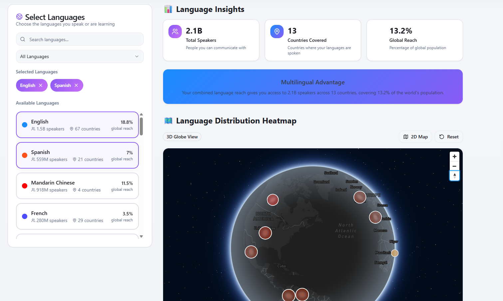
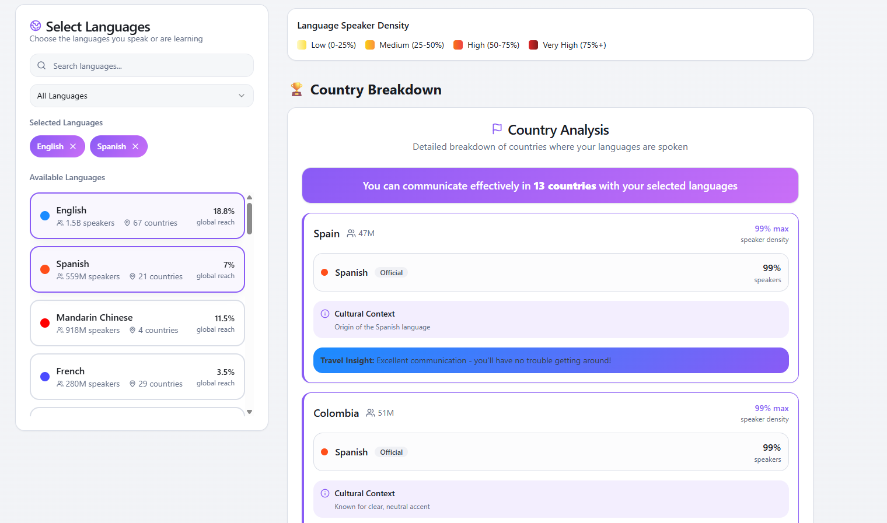

# **🌍 GeoLingua**

**GeoLingua** is an interactive web platform that visualizes the global reach of languages. The app helps users understand how many people they can communicate with globally based on the languages they know.


## 🔍 Overview

* 🌐 **Language Coverage Visualization:** Instantly see how much of the world you can communicate with based on selected languages — via dynamic heatmaps and country-level stats.
* 🧮 **Global Communication Score:** Calculates cumulative population reach across multiple languages, showing real-time % of global coverage.
* 🗺️ **Interactive Map UI:** Select languages and explore world regions where they’re spoken — with hover/click insights for native, L2, and official status.
* 🤖 **LLM-Powered Queries:** Ask natural language questions like *"How many people can I interact with English and Spanish?"* — answered instantly by integrated AI.
* 🧭 **Travel & Learning Insights:** Identify language-friendly travel destinations or get AI-suggested “next best language to learn” based on your goals.
* ⚙️ **Built Using AI Tools:** Developed using **Lovable**, **Gemini CLI**, and **ChatGPT**, streamlining full-stack development, UI prototyping, and data logic.


## **📑 Table of Contents**

- [Overview](#-overview)
- [Features](#-features)
- [Demo](#-demo)
- [Future Roadmap and Potential Features](#-future-roadmap-and-potential-features)
- [Origin](#-origin)
- [Quick Start](#quick-start)
- [Comparable Projects](#-comparable-projects)
- [Target Users & Use Cases](#-target-users--use-cases)
- [Risks & Challenges](#️-risks--challenges)
- [Potential Monetization & Growth Ideas](#-potential-monetization--growth-ideas)
- [Known Issues](#-known-issues)
- [Technical Details](#-technical-details)
- [Built With](#-built-with)
- [Lovable Prompt](#-lovable-prompt)
- [Author](#-author)
- [License](#-license)


## 🧠 **Features**

1. ### **Interactive Language Heatmap**
   - World map colored by % of population speaking the selected language(s).
   - Hover or click a country to view stats (native speakers, secondary speakers, official status).

2. ### **Global Communication Coverage**
   - Live calculation of total global population the user can communicate with.
   - Supports cumulative reach with multi-language selection.

3. ### **Language Insights Panel**
   - Total speakers (native + non-native), global rank, geographic spread.
   - Country-wise list sorted by % speakers.

4. ### **LLM “Instant Reach” Query**
   - Natural-language interface to ask:  
     *“If I speak English, Spanish, and Hindi, how many people can I reach?”*

5. ### **Personalized Communication Score & Badge**
   - AI calculates a badge like:  
     🏅 *“You can talk to 70% of the world!”*  
     ...with a short explanation and stats.

6. ### **Travel-Friendliness Visualization**
   - Highlights countries where the selected language(s) are enough for basic travel.
   - Filter by tourism relevance or region.


## 🎥 Demo






## 🔮 **Future Roadmap and Potential Features**

- 📤 **Shareable Snapshots** – Export your language coverage map as a visual.
- 🔀 **Multilingual Overlay** – Visualize overlapping regions for your selected languages.
- 📊 **Cumulative Coverage Bar** – Updates live as you add/remove languages.
- 🧠 **AI "Next Best Language" Recommender** – Suggests next language to learn to maximize reach.
- 🧳 **AI-Powered Travel Itinerary Generator** – Builds plans based on your location, nationality, and known languages.
- 🆚 **Language Comparison Mode** – Compare 2–3 languages for overlap, speakers, and reach.
- 💬 **Conversational Data Explorer** – “Ask anything” interface over the dataset.  
  *e.g.,* *“Which African countries have >40% English speakers as L2?”*

---

## **Origin**

### **Initial Concept (2015 – 2017)**

The idea sparked while I was learning Spanish on Duolingo around 2015. I realized how widely Spanish, Hindi, and English are spoken — and that by learning just these, I could communicate with nearly half the global population.

This led to a vision: a platform where users could input the languages they speak and instantly visualize their communication reach — using heatmaps, population percentages, and interactive country-level stats. Back then, with limited mobile data and no real-time translation tools, it also seemed like a useful travel planner for language-ready destinations.

### **Inspiration**

- [`tiii.me`](https://tiii.me) – A minimal tool to calculate time spent watching TV shows, which inspired a similarly simple and powerful interaction model.

### **Why I Couldn't Build It Then**

I lacked full-stack development skills at the time. Today, with the rise of tools like **Lovable** and AI-powered coding workflows, the idea can finally be executed.

---

**Quick Start**

Follow these steps:

```sh
# Step 1: Clone the repository using the project's Git URL.
git clone <YOUR_GIT_URL>

# Step 2: Navigate to the project directory.
cd <YOUR_PROJECT_NAME>

# Step 3: Install the necessary dependencies.
npm i

# Step 4: Start the development server with auto-reloading and an instant preview.
npm run dev
```
---

# 🔍 **Comparable Projects**

### **Closest Existing Tools**

| Tool           | What It Does                            | What It Lacks                            |
|----------------|-----------------------------------------|------------------------------------------|
| Ethnologue     | Rich language database                  | Static, not interactive or visual        |
| Duolingo Stats | Speaker numbers for popular languages   | No global visualizations                 |
| WorldPop       | Geographic demographic data             | Not language-specific                    |


### **How GeoLingua Stands Out**

* 🌍 Interactive maps > static tables.
* ➕ Multi-language combo calculations.
* 🎯 Focuses on practical insights for learners and travelers not just linguistic statistics.
* ⚡️ Built for modern UI/UX with real-time interaction and heatmaps. 


## 👥 **Target Users & Use Cases**

### **Target Users**

| User Type         | Example Case                                                             |
|-------------------|--------------------------------------------------------------------------|
| 🌱 Language Learners | Understand global impact of languages they’re studying                 |
| ✈️ Travelers / Nomads | Choose destinations based on language familiarity                     |
| 🧠 Educators         | Demonstrate language geography and relevance in class or presentations |

### **Use Cases**
* Find how many people one can communicate with based on known languages.
* Discover which new language gives the maximum global communication advantage.
* Plan travel destinations with fewer language barriers.


## ⚠️ **Risks & Challenges**

* **Accurate Data:** Combining datasets (e.g., % speakers in each country) from reliable sources.
* **Variants and Dialects:** Managing regional differences (e.g., Latin American Spanish vs. Castilian).
* **Performance:** Interactive heatmaps with large datasets.


## 💰 Potential Monetization

* Freemium dashboard (free core + pro insights)
* Partner with Duolingo / Babbel / TripAdvisor
* Offer developer-facing **Language Data API**
* Ads / affiliate marketing for courses and travel tools


## **🐛 Known Issues**


## Technical Details

### Architecture Overview

**GeoLingua** is a React-based web application that visualizes global language distribution through interactive 3D maps and statistical dashboards.

### Technology Stack

- **Frontend**: React 18 + TypeScript + Vite
- **3D Graphics**: React Three Fiber + Three.js + React Three Drei
- **UI Components**: shadcn/ui + Tailwind CSS
- **State Management**: React hooks + custom service layer
- **Data Format**: Static JSON with language and geographic data

### Data Pipeline

**Language Data Service**
- Language data is served from static JSON files in `/public/data/languages.json`
- `LanguageService` provides caching layer and API abstraction
- Data structure includes speaker counts, country distributions, and geographic coordinates
- Custom hooks (`useLanguages`) manage async data fetching and state

**3D Globe Integration**
- User language selections trigger real-time data filtering
- Geographic coordinates are mapped to 3D sphere positions using spherical coordinate conversion
- Country markers are dynamically positioned and colored based on language coverage intensity
- Language connection arcs are generated between countries sharing selected languages

**Visual Output System**
- Country intensity calculated from speaker percentages (0-100%)
- Color gradients represent language coverage: green (low) → yellow → red (high)
- Day/night textures simulate realistic Earth appearance with dynamic lighting
- Atmospheric glow and country borders enhance visual appeal
- Smooth animations and interactions provide responsive user experience

### Performance Optimizations

- Texture caching and memoization for 3D rendering
- Efficient re-rendering through React optimization patterns
- Level-of-detail scaling for country markers based on coverage
- Debounced user interactions to prevent excessive re-calculations

## 🛠 Built With
* **Frontend:** React, Tailwind CSS
* **Backend:** Node.js, Express
* **Other Tools:** Lovable, shadcn-ui, Gemini CLI

## 🧠 Lovable Prompt

Build a modern web app that visualizes the global reach of languages. A user can select one or more languages they speak (or are learning) and instantly see:
- A world map heatmap highlighting regions where the language is spoken, color-coded by the percentage of the population.
- Key stats like total number of speakers, number of countries, and global population coverage.
- A country-wise breakdown (official language status, % speakers, and cultural notes).
The app should feature an intuitive dashboard with interactive maps, charts, and comparisons. It should answer questions like:
‘If I know English and Spanish, how many people can I communicate with globally?’

## **👤 Author**

**Karan Gupta**

---

## **📜 License**

This project is licensed under the MIT License - see the [LICENSE](LICENSE) file for details.

